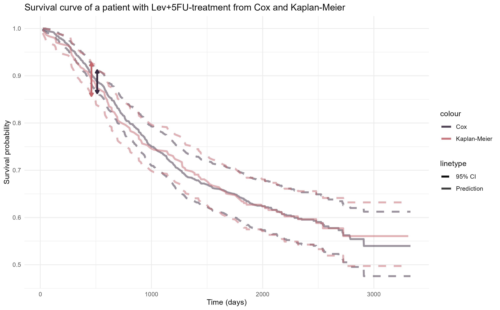
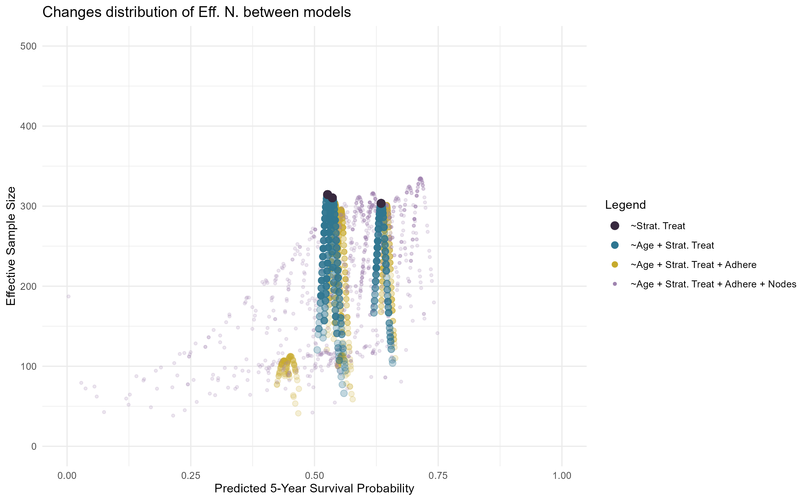

```{r setup, include=FALSE}
knitr::opts_chunk$set(
  echo = FALSE,       # Hide the R code itself
  warning = FALSE,    # Hide warning messages
  message = FALSE,    # Hide loading messages (like library startup text)
  results = 'hide',   # Optional: Hide text output (don't use if you want to see tables)
  error = FALSE       # Stop the document from knitting if there is an error
)
library(tinytex)
```

# Supplement 1: 4D PICTURE Collaborators

# Supplement 2: Distribution of predictors
The first was the `adhere` variable, a dichotomous indicator for adhesion of the tumor to nearby organs (135 of 929 patients, @fig-variables). Next was `rx`, a three-level categorical variable of the three treatment arms from the trial. Third was age as a continuous variable. The mean age was 60 years with a standard deviation of 12 years. The age distribution was left-skewed (@fig-variables). Finally, nodes was a heavily right-skewed variable (median 4 nodes, range of 0 to 33).

```{r}
#| echo: FALSE
#| output: FALSE
#| warning: FALSE
#| label: fig-variables
#| fig-width: 10
#| fig-height: 7
#| fig-cap: "Distribution of 4 prognostic factors in the colon dataset. Adhere: adhesion of the tumor. Treatment with three levels: Obs - Observation; Lev: levimasole; Lev+5FU - levimasole+5-fluorouracil. Age in years. Nodes: number of lymph nodes with detectable cancer."

source("code/compile.R")

# Calculate the maximum frequency for bar plots
max_bar_freq <- max(table(colon_df$adhere), table(colon_df$rx))

# Calculate the maximum frequency for histograms
max_hist_freq <- max(table(cut(colon_df$age, breaks = seq(min(colon_df$age), max(colon_df$age) + 5, by = 5))),
                     table(colon_df$nodes))

# 1. Bar plot of frequency of adhere "Yes" (1) and "No"(0)
plot1 <- ggplot(colon_df, aes(x = factor(adhere, levels = c(0, 1), labels = c("No", "Yes")))) +
  geom_bar(fill = col["b"], col = 'black') +
  labs(x = "Adherence", y = "Frequency") +
  theme_minimal() +
  ylim(0, max_bar_freq)

# 2. Bar plot of frequency of rx "Male"(0), "Female"(1)
plot2 <- ggplot(colon_df, aes(x = factor(rx, levels = c("Obs", "Lev", "Lev+5FU"), labels = c("Obs", "Lev", "Lev+5FU")))) +
  geom_bar(fill = col["lp"], col = 'black') +
  labs(x = "Treatment", y = "Frequency") +
  theme_minimal() +
  ylim(0, max_bar_freq)

# 3. Histogram of age
plot3 <- ggplot(colon_df, aes(x = age)) +
  geom_histogram(binwidth = 5, fill = col["r"], color = "black") +
  labs(x = "Age", y = "Frequency") +
  theme_minimal() +
  ylim(0, max_hist_freq)

# 4. Histogram of nodes
plot4 <- ggplot(colon_df, aes(x = nodes)) +
  geom_histogram(binwidth = 1, fill = col["y"], color = "black") +
  labs(x = "Nodes", y = "Frequency") +
  theme_minimal() +
  ylim(0, max_hist_freq)

# Combine the plots using patchwork
combined_plot <- (plot1 | plot2) / (plot3 | plot4)

# Print the combined plot
print(combined_plot)

```


# Supplement 3: Cox model has narrower 95% CI than Kaplan-Meier
The 95% confidence interval of a Cox model prediction for a patient is narrower than that of a Kaplan-Meier curve for the patient with the same treatment. This shows that the Cox model is more certain than the Kaplan-Meier and is therefore expected to have a higher effective sample size.
```{r, echo=FALSE, out.width="70%", fig.align="center", fig.cap="The 95% Confidence Interval of a Cox model prediction for a patient with `Lev+5FU` (Levimasole + Fluorouracil) treatment is smaller than the 95% Confidence Interval of the Kaplan-Meier curve for the same treatment. The effect is most visible early on in follow-up, e.g. at 500 days.", output = TRUE}

```

# Supplement 4: Effective sample size of mean patient is N_dev in linear regression

Effective sample size of a mean patient is equal to the development sample size in a linear regression model:

We follow the code by @thomassen2024

```{r, echo = TRUE, output = TRUE}
library(Hmisc)
getHdata(gusto)
gusto.dat <- gusto

#Create a subset of the data with centers from US region and one non-US region
gusto.dat <- gusto[which(gusto$grpl %in% c(1,2,4) & gusto$grps %in% c(5,9,10,11)),]

## uncorrelated continuous predictors age, height
#plot(gusto.dat$age, gusto.dat$hei)

##Center the variables
gusto.dat$age <- gusto.dat$age- mean(gusto.dat$age)
gusto.dat$hei <- gusto.dat$hei- mean(gusto.dat$hei)

## Calculate effective sample sizes
X_ols <- model.matrix(~age+hei, data=gusto.dat)
XTX <- t(X_ols)%*%X_ols

n_eff_OLS <- numeric(length = nrow(X_ols))

for(i in 1:length(n_eff_OLS)){
  A <- solve(XTX)%*%X_ols[i,]
  n_eff_OLS[i] <- 1/(t(X_ols[i,])%*%A)
}

neff_all <- data_frame(pat.id = (1:nrow(X_ols)),form="form0", n_eff_OLS = n_eff_OLS)

## Visualisation
#ggplot(neff_all, aes(x=n_eff_OLS))+
#  geom_histogram(alpha=0.8, position = "identity")+
#  theme_bw()

print(paste0("Maximum effective sample size in development sample: ", round(max(neff_all$n_eff_OLS), 1) ) )

model <- lm(day30~age+hei, data=gusto.dat)
new <- matrix(c(1, 0, 0), nrow = 1, ncol=3)
A <- solve(XTX)%*%t(new)
n_eff <- 1/(new%*%A)

print(paste0("Effective sample size of a patient with mean height and age: ", n_eff))
```


# Supplement 5: Effective sample size in regression models not based on time-to-event data

Effective sample size in linear regression models based on one continuous and one categorical variable are bounded by the number of patients in the same category. Below is an example in the GUSTO data for a linear regression model based on age and sex. The mean (normalized) age is no longer 0, but the mean age within your category (in this case among those with 'sex' == 'female'). 

```{r, echo = TRUE, output = TRUE}
model <- lm(height ~ age + sex, data = gusto.dat)
X_ols <- model.matrix(~age+sex, data=gusto.dat)
XTX <- t(X_ols)%*%X_ols
m_age_sex <- mean(gusto.dat[gusto.dat$sex == "female", "age"])
new <- matrix(c(1, m_age_sex, 1), nrow = 1, ncol=3)
A <- solve(XTX)%*%t(new)
n_eff <- 1/(new%*%A)
print(paste0("Number of patients with your sex: ", sum(gusto.dat$sex == "female")))
print(paste0("Effective sample size of someone with mean age of your sex: ", round(n_eff)))
```

In logistic regression we borrow information and effective sample size can be higher than in your cohort. Below is the same model based on age and gender, but now using a glm with logit link function:

```{r, echo = TRUE, output = TRUE}
LR0.fit <- glm(formula = day30 ~ age + sex, data = gusto.dat, family = binomial(link = "logit"))
neff <- c()

cov.beta <- vcov(LR0.fit)
X_LR0 <- model.matrix(LR0.fit)

new <- data.frame(age=0, sex="female")
pred <- predict(LR0.fit, newdata = new, type = "response", se.fit = TRUE)
neff$pi.pred <- pred$fit
neff$pi.se <- pred$se.fit
neff$vary_xnew <- neff$pi.pred*(1-neff$pi.pred)
mm <- matrix(c(1, 0, 1), nrow = 1, ncol = ncol(X_LR0))
neff$n_eff_LR <- 1/((mm %*% (cov.beta %*% t(mm)))*neff$vary_xnew)


print(paste0("Number of patients with your sex: ", sum(gusto.dat$sex == "female")))
print(paste0("Effective sample size of a patient with mean age and your sex based on logistic regression: ", 
             round(max(neff$n_eff_LR))))
```

We can prevent this borrowing of information by including an interaction term between age and sex. Below is the same logistic model but now with an interaction term for age and sex:

```{r, echo = TRUE, output = TRUE}
LR1.fit <- glm(formula = day30 ~ age + sex + age:sex, data = gusto.dat, family = binomial(link = "logit"))
neff <- c()

cov.beta <- vcov(LR1.fit)
X_LR1 <- model.matrix(LR1.fit)

new <- data.frame(age=0, sex="female")
pred <- predict(LR1.fit, newdata = new, type = "response", se.fit = TRUE)
neff$pi.pred <- pred$fit
neff$pi.se <- pred$se.fit
neff$vary_xnew <- neff$pi.pred*(1-neff$pi.pred)
mm <- matrix(c(1, 0, 1, 0), nrow = 1, ncol = ncol(X_LR1))
neff$n_eff_LR <- 1/((mm %*% (cov.beta %*% t(mm)))*neff$vary_xnew)


print(paste0("Number of patients with your gender: ", sum(gusto.dat$sex == "female")))
print(paste0("Effective sample size of a patient with mean age and your gender based on logistic regression with an interaction term: ", 
             max(neff$n_eff_LR)))
```

Effective sample size is more than halved, implying that the interaction term removed any borrowing of information.


# Supplement 6: Multivariable Cox effective sample size with separate baseline hazards for age

```{r}
#| echo: FALSE
#| output: FALSE
#| eval: FALSE
#| message: FALSE
#| warning: FALSE
#| fig-width: 10
#| fig-height: 7
#| label: fig-distribution-strata-dev
#| fig-cap: "Distribution of effective sample size for the 5-year survival prediction in the data as a function of the predicted 5-year survival probability from a Cox model stratified by treatment for separate baseline hazards. First model includes only stratified treatment The second model adds age, the third model adds adherence and the fourth model adds nodes. It can be seen that the effective sample size does not decrease for all patients with increasing variables, but it does for patients with rare covariate values."

source("code/compile.R")

year <- 5
var1 <- "strata(rx)"; var2 <- "age + strata(rx)"; var3 <- "age + strata(rx) + adhere"; var4 <- "age + strata(rx) + adhere + nodes"
leg1 <- "Strat. Treat"; leg2 <- "Age + Strat. Treat"; leg3 <- "Age + Strat. Treat + Adhere"; leg4 <- "Age + Strat. Treat + Adhere + Nodes"


# Single impute the nodes data
colon_df$nodes <- mice::complete(mice::mice(colon_df, m = 1, print = FALSE))$nodes

# Fit all cox models
cox_model1 <- coxph(Surv(time, status) ~ strata(rx), data = colon_df)
cox_model2 <- coxph(as.formula(paste0( "Surv( time, status) ~ ", var2)), data = colon_df)
cox_model3 <- coxph(as.formula(paste0( "Surv( time, status) ~ ", var3)), data = colon_df)
cox_model4 <- coxph(as.formula(paste0( "Surv( time, status) ~ ", var4)), data = colon_df)

# Create prediction df
out_df <- colon_df |>
  select( rx, age, adhere, nodes )


# Create SF object for correct time
sf1 <- summary( survfit(cox_model1), time = year*365.25)
sf2 <- summary( survfit(cox_model2, newdata = out_df), time = year*365.25 )
sf3 <- summary( survfit(cox_model3, newdata = out_df), time = year*365.25 )
sf4 <- summary( survfit(cox_model4, newdata = out_df), time = year*365.25 )

# Save survival probabilities
out_df$surv1 <- 0
out_df[out_df$rx == "Obs",]$surv1 <- sf1$surv[1] 
out_df[out_df$rx == "Lev",]$surv1 <- sf1$surv[2]
out_df[out_df$rx == "Lev+5FU",]$surv1 <- sf1$surv[3]
out_df$surv2 <- c(sf2$surv)
out_df$surv3 <- c(sf3$surv)
out_df$surv4 <- c(sf4$surv)

# Calculate the effective sample size for the 5-year prediction
out_df$n.eff1 <- 0
out_df[out_df$rx == "Obs",]$n.eff1 <- (1-out_df[out_df$rx == "Obs",]$surv1)*out_df[out_df$rx == "Obs",]$surv1/(c(sf1$std.err[1])^2)
out_df[out_df$rx == "Lev",]$n.eff1 <- (1-out_df[out_df$rx == "Lev",]$surv1)*out_df[out_df$rx == "Lev",]$surv1/(c(sf1$std.err[2])^2)
out_df[out_df$rx == "Lev+5FU",]$n.eff1 <- (1-out_df[out_df$rx == "Lev+5FU",]$surv1)*out_df[out_df$rx == "Lev+5FU",]$surv1/(c(sf1$std.err[3])^2)
out_df$n.eff2 <- (1-out_df$surv2)*out_df$surv2/(c(sf2$std.err)^2)
out_df$n.eff3 <- (1-out_df$surv3)*out_df$surv3/(c(sf3$std.err)^2)
out_df$n.eff4 <- (1-out_df$surv4)*out_df$surv4/(c(sf4$std.err)^2)

# Create a scatter plot
colors <- c("1" = "#37293F", "2" = "#2E7691",  "4" = "#9f84af", "3" = "#c6aa2c")
plot <- ggplot(out_df) +
  geom_point( aes(x = surv3, y = n.eff3, color = "3"), data = out_df, alpha = 0.2, size = 2) +
  geom_point( aes(x = surv4, y = n.eff4, color = "4"), data = out_df, alpha = 0.2, size = 1) +
  geom_point( aes(x = surv2, y = n.eff2, color = "2"), data = out_df, alpha = 0.3, size = 2.5) +
  geom_point( aes(x = surv1, y = n.eff1, color = "1"), data = out_df, alpha = 1, size = 3) +
  scale_x_continuous(name = "Predicted 5-Year Survival Probability", limits = c(0, 1)) +
  scale_y_continuous(name = "Effective Sample Size", limits = c(0, 500)) +
  ggtitle("Changes distribution of Eff. N. between models") +
  labs( color = "Legend") +
  scale_color_manual(
    values = colors,
    labels = c(paste0("~", leg1), paste0("~", leg2), paste0("~", leg3), paste0("~", leg4))
  ) +
  theme_minimal() +
  theme(legend.position = "right") + 
  guides(colour = guide_legend(override.aes = list(alpha = 1)))


# Print the plot
plot

# Make a dataframe with observations named after leg1-4 and in the columns, the mean, median, 2.5-25-75-97.5 percentiles then show it in a table
df_tab <- data.frame(
  q2.5 = c(quantile(out_df$n.eff1, 0.025), quantile(out_df$n.eff2, 0.025), quantile(out_df$n.eff3, 0.025), quantile(out_df$n.eff4, 0.025)),
  q25 = c(quantile(out_df$n.eff1, 0.25), quantile(out_df$n.eff2, 0.25), quantile(out_df$n.eff3, 0.25), quantile(out_df$n.eff4, 0.25)),
  mean = c(mean(out_df$n.eff1), mean(out_df$n.eff2), mean(out_df$n.eff3), mean(out_df$n.eff4)),
  median = c(median(out_df$n.eff1), median(out_df$n.eff2), median(out_df$n.eff3), median(out_df$n.eff4)),
  q75 = c(quantile(out_df$n.eff1, 0.75), quantile(out_df$n.eff2, 0.75), quantile(out_df$n.eff3, 0.75), quantile(out_df$n.eff4, 0.75)),
  q97.5 = c(quantile(out_df$n.eff1, 0.975), quantile(out_df$n.eff2, 0.975), quantile(out_df$n.eff3, 0.975), quantile(out_df$n.eff4, 0.975))
)
rownames(df_tab) <- c(paste0("~", leg1), paste0("~", leg2), paste0("~", leg3), paste0("~", leg4))
colnames(df_tab) <- c("2.5%", "25%", "Mean", "Median", "75%", "97.5%")
#df_tab

plot
save(plot, file="images/fig-distribution-strata.Rdata")
ggsave("images/distribution_strata.png", width = 10, height = 6.2, dpi = 300)

#rm( list = ls())
```
```{r, echo=FALSE, out.width="70%", fig.align="center", fig.cap="Distribution of effective sample size for the 5-year survival prediction in the data as a function of the predicted 5-year survival probability from a Cox model stratified by treatment for separate baseline hazards. First model includes only stratified treatment The second model adds age, the third model adds adherence and the fourth model adds nodes. It can be seen that the effective sample size does not decrease for all patients with increasing variables, but it does for patients with rare covariate values.", output = TRUE}

```

# Supplement 7: Heuristic explanation of higher than total sample size
To show the outcomes, we rerun the simulation:
```{r}
source("code/compile.R")
require(surveillance)

# Seed for consistency
set.seed(1923)

scale = c(10)
shape = c(1) # shape 1 means exponential
maxtime = 100 # maxtime
hr = 2 # hazard ratio
n = 5000 # number per group

events <- simsurv( dist="weibull", 
                   gammas=shape, 
                   lambdas=scale[1]^(-shape), 
                   x=data.frame(tx = c(rep(0, n), rep(1, n))),
                   betas = c("tx" = log(hr)),
                   maxt=maxtime)
events$tx = c(rep(0, n), rep(1, n))
events$eventtime[8885] <- 2.997671  # handmatig ties weghalen
events$eventtime[6298] <- 5.668818  # werkt omdat seed vast staats
time <- sort(unique(events$eventtime))
time0 <- sort(unique(events[events$tx == 0, ]$eventtime))
time1 <- sort(unique(events[events$tx == 1, ]$eventtime))

# Fit the models
sf0 <- survfit(Surv(eventtime, status) ~ 1, data = events[events$tx == 0,])
sf1 <- survfit(Surv(eventtime, status) ~ 1, data = events[events$tx == 1,])
cox <- coxph(Surv(eventtime, status) ~ tx, data = events)

# Calculate effective N and stuff
sf_n0 <- survfit_n(sf0) |> sf_to_df(time = time0)
sf_n1 <- survfit_n(sf1) |> sf_to_df(time = time1)
cox_n0 <- survfit_n(survfit(cox, newdata = data.frame(tx = 0)), cox, coef=T, chaz=T)
cox_n1 <- survfit_n(survfit(cox, newdata = data.frame(tx = 1)), cox, coef=T, chaz=T)

cox_n0 <- sf_to_df(cox_n0, time = time)
cox_n1 <- sf_to_df(cox_n1, time = time)
```

Our assumption/hypothesis is that the effective sample size at the beginning is this $\frac{HR_{new}}{Total risk}$ value. We cannot estimate variance before any events, so we analyse this hypothesis at the first event time. As we simulate with a HR of 2, we expect the total risk to be equal to $5000\cdot 1 + 5000 \cdot 2 = 15000$, the effective sample size for a female patient with HR of 1 should have an effective sample size of 15,000 (the denominator) and a male patient with HR of 2 should have an effective sample size of 7,500 (the denominator divided by HR). 

```{r, output = TRUE}
print(paste0("The Cox model imperfectly estimates the hazard ratio, estimating it as: ", round(exp(cox$coefficients),5), ". The expected effective sample size for women after one event, with this new assumed HR becomes ", round(5000*exp(cox$coefficients)+5000) , " (rounded to integer), and ", round((5000*exp(cox$coefficients)+5000)/exp(cox$coefficients)), " for men. However, we find that our effective sample size is estimated as ", round(cox_n0$n.eff[1]), " for women and ", round(cox_n1$n.eff[1]), " for men. The discrepancy for women may be caused by the variance from coefficient estimation, event if that is very small at this early time. If we assume the coefficient is perfectly estimated and only consider the variance caused by baseline hazard estimation, we find effective sample sizes of ", round( (1 - cox_n0$surv[1])/ (cox_n0$surv[1] * cox_n0$std.chaz[1]^2)), " for women. This matches our hypothesis exactly. For men, it appears the impact of the coefficient estimation is too small to be a factor in the effective sample size at this early time."))
```

# Supplement 8: Coefficient variance investigated
We need to investigate this at a time where we have quite a lot of knowledge of the ratio of the two groups in the data. At some point in time, the ratio between the two survival probabilities will be exactly 2. We will evaluate at this time $t$. We can find this by calculating:
\begin{align}
\frac{S(t| Woman )}{S(t | Man)} &= 2\\
\log(S(t| Woman)) - \log(S(t | Man)) &= \log(2)\\
-H(t| Woman) + H(t| Man) & = \log(2)\\
-10t + HR\cdot 10 t &=\log(2)\\
t &= \frac{10}{(HR - 1)}\log(2)
\end{align}

```{r, output = TRUE}
print(paste0("With our HR of ", round(exp(cox$coefficients), 5), ", this time becomes: ", round( (10/(exp(cox$coefficients) - 1))*log(2), 4), " time units."))
```

First, we look at the first event time and assume no one left the risk set. At the time of the first event, we assume that the number at risk in both groups is still $5000$. This means that $w_{men}$ is: $w_{men} = \frac{1}{5000+2\cdot 5000}\left\{\frac{2\cdot 5000}{5000+2\cdot 5000} - 1 \right\} = -\frac{1}{45000}$ and $w_{women} = \frac{2}{5000+2\cdot 5000}\left\{\frac{2\cdot 5000}{5000+2\cdot 5000} - 0 \right\} = \frac{2}{45000}$. 

Of course this is not all - the gradient is $\mathrm{exp}(\beta^\top \mathbf{X}_{new})w$, which is $-\frac{2}{45000}$ for men and $\frac{2}{45000}$ for women. This is as expected, since men and women are both equally distant from the population mean in the risk set. Then the coefficient variance is (for one variable) the squared gradient times the variance of the coefficient, the last of which is constant. 

At $t=6.913$, we can calculate the increment of the gradient by hand, which should be $2\cdot w_{men} = 2\cdot\frac{1}{2500+2\cdot 1250}\left\{\frac{2\cdot 1250}{2500+2\cdot 1250} - 1 \right\} = -2\cdot\frac{1}{10000}$ for men and $w_{women} = \frac{1}{2500+2\cdot 1250}\left\{\frac{2\cdot 1250}{2500+2\cdot 1250} - 0 \right\} = \frac{1}{10000}$ for women. We see that the increment of the gradient is now twice as high for men. 